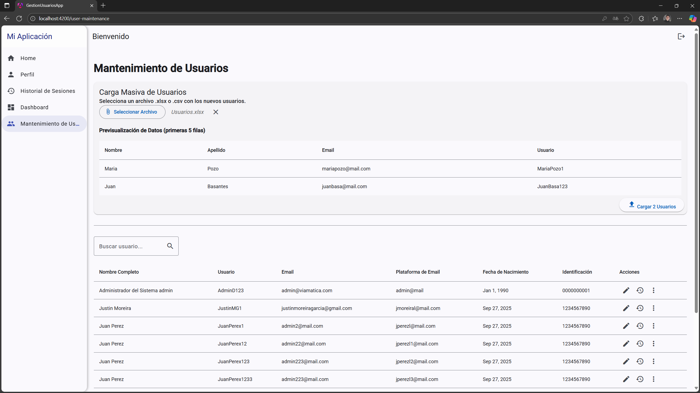

# PRUEBA TECNICA JUSTIN MOREIRA - FINALIZADA

Disculpas, tuve problemas con el repositorio anterior y me toco subir uno nuevo, pero igualmente lo dejare comentado en el correo y en el repositorio viejo.
En la raiz de este repositorio dejaré el script del stored procedure y del trigger de la base de datos en SQL Server. Es importante ejecutarlos ya que tienen la funcionalidad de crear el correo a los usuarios nuevos que se registran (bajo las instrucciones del requerimiento estipulado en la prueba). También adjuntaré algunas capturas y un enlace a un video donde se demuesrta el funcionamiento de la aplicación. Muchas gracias de antemano y quedo atento a cualquier novedad.

[Video demostracion del sistema](https://uniandeseduec-my.sharepoint.com/:v:/g/personal/justinmg45_uniandes_edu_ec/EYrXf_kajkVGn98lznlUqaQB4mrNyGkpFSeT4_4YUo_K4Q?e=bv01hS)

## Screenshots

